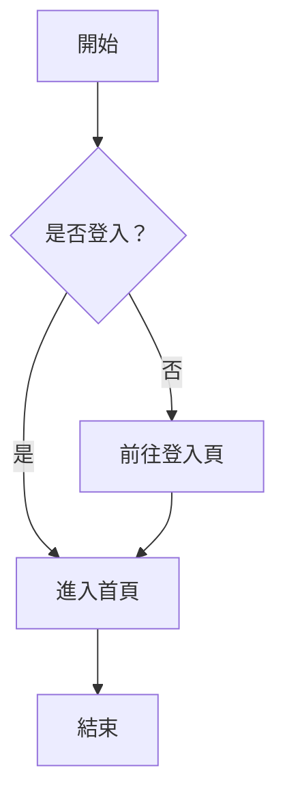
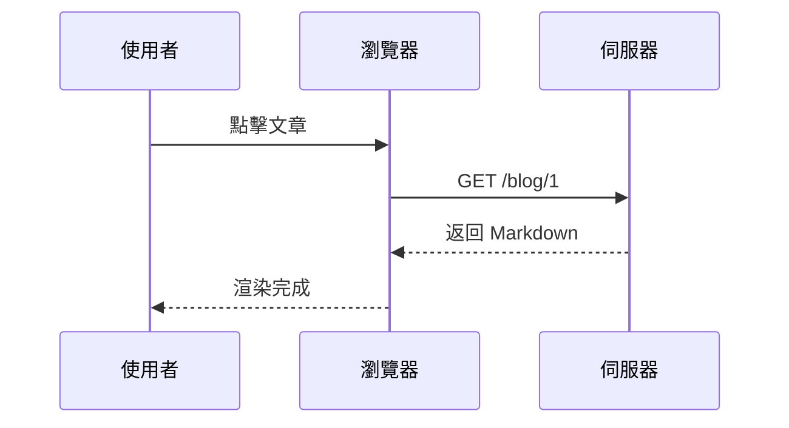

# Markdown 大全

歡迎使用 **Blog Meow** ！這是一篇完整的 Markdown 範例文章，展示本站所支援的所有語法。

---

## 標題 H1 ~ H6

# H1 標題
## H2 標題
### H3 標題
#### H4 標題
##### H5 標題
###### H6 標題

---

## 文字樣式

**粗體** ，*斜體* ，***粗斜體*** ，~~刪除線~~ ，<u>底線</u> 。

行內程式碼： `const meow = "Blog Meow"`

按鍵： <kbd>⌘</kbd> + <kbd>K</kbd> 開啟搜尋。

下標 H<sub>2</sub>O ，上標 E = mc<sup>2</sup> 。

Escape 字元： \*這不是斜體\* 、\`不是程式碼\` 。

---

## 引用

> 這是一段引用文字。
>
> 可以包含多行。

### 巢狀引用

> 第一層引用
>
> > 第二層引用
> >
> > > 第三層引用

---

## 清單

### 無序清單

- 蘋果
- 香蕉
  - 巴西蕉
  - 芭蕉
- 櫻桃

### 有序清單

1. 起床
2. 喝咖啡
3. 寫程式
   1. 開啟編輯器
   2. 開始打字

### Task List

- [x] 建立專案
- [x] 設計首頁
- [ ] 撰寫文章
- [ ] 部署上線

---

## 程式碼區塊

### JavaScript

```javascript
// Fibonacci
function fib(n) {
  if (n < 2) return n;
  return fib(n - 1) + fib(n - 2);
}

console.log(fib(10));
```

### Python

```python
def greet(name: str) -> str:
    return f"Hello, {name}!"

print(greet("Meow"))
```

### HTML

```html
<div class="card">
  <h1>Hello</h1>
  <p>World</p>
</div>
```

---

## 分隔線

---

## 連結與圖片

[Lovable 官方網站](https://lovable.dev)

自動連結： https://github.com

### 圖片


### HTML 控制圖片大小


---

## 表格

| 名稱 | 年齡 | 職業 |
| ---- | ---- | ---- |
| 小明 | 25   | 工程師 |
| 小華 | 30   | 設計師 |
| 小美 | 28   | PM |

### 對齊表格

| 左對齊 | 置中 | 右對齊 |
| :----- | :--: | -----: |
| A      |  B   |      C |
| 蘋果   | 香蕉 |   櫻桃 |

---

## HTML 混用

<div align="center">
  <strong>這是一段置中的 HTML 區塊</strong>
</div>

---

## Details 摺疊區塊

<details>
<summary>點擊展開更多內容</summary>

這是隱藏的內容，可以包含 **Markdown** 語法。

- 項目 1
- 項目 2

</details>

---

## GitHub Alerts

> [!NOTE]
> 這是一段筆記，提供額外資訊。

> [!TIP]
> 一個小技巧，能讓你的工作更有效率。

> [!IMPORTANT]
> 重要訊息，請務必閱讀。

> [!WARNING]
> 警告：操作前請備份資料。

> [!CAUTION]
> 危險操作，請格外小心。

---

## Mermaid 流程圖





---

## 結語

感謝你閱讀這份 Markdown 大全！🎉

希望這份教學能幫助你快速上手 **Blog Meow** 。
